# Lab 1: Compiler Construction — Compilation Pipelines & Performance Benchmarking

[](https://isocpp.org/)
[](https://www.python.org/)
[](https://gcc.gnu.org/)
[](https://www.bnu.edu.pk/)
[](https://conventionalcommits.org)

---

## 📌 Academic Metadata

- **Institution:** Beaconhouse National University (BNU) — School of Computer & Information Technology (SCIT)
- **Course:** Lab-410: Compiler Construction Lab (Fall 2026)
- **Course Lecturer & Lab Instructor:** Sheeza Batool
- **Student Name:** Saad Mughal
- **Student ID / Roll No:** F2023-009
- **Section:** C
- **Course Learning Outcome:** CLO 1

---

## 📖 Executive Summary

This repository contains the laboratory implementations, empirical benchmark datasets, toolchain artifacts, and academic reports for **Lab 1: Compiler Construction**.

The lab investigates the fundamental operational paradigms separating **Ahead-Of-Time (AOT) Compiled Languages** (represented by C++ with `g++`) from **Bytecode-Interpreted Virtual Machine Languages** (represented by Python with CPython). The laboratory is organized into two primary investigations:

1. **Task 1 — Compiler vs. Interpreter Performance Comparison:** An empirical benchmark across four algorithmic workloads (tight loops, recursion, branching, and sorting) measuring compile time, raw execution latency, and amortization thresholds.
2. **Task 2 — Dissecting the `g++` Toolchain Pipeline & Python Bytecode:** A stage-by-stage manual invocation of the four phases of the GCC compilation pipeline (`-E`, `-S`, `-c`, and linking), an examination of internal driver sub-programs (`cc1plus`, `as`, `collect2`), and disassembly of Python bytecode using `dis` and `__pycache__` artifacts.

---

## 📂 Repository Directory Layout

```text
lab-1-compiler-construction/
├── .gitignore                          # Git ignore rules for OS, IDE, and temporary cache
├── README.md                           # Comprehensive documentation and lab report
│
├── task 1/                             # Task 1: Time Comparison Benchmarks
│   ├── CC _ Lab 1 - Task 1.docx        # Completed student submission report
│   ├── Lab410_Task1_CompilerVsInterpreter.docx # Official lab specification & instructions
│   ├── sumA.cpp                        # Program A: 100M integer sum loop (C++)
│   ├── sumA.py                         # Program A: 100M integer sum loop (Python)
│   ├── sumA                            # Program A: Compiled ELF/PE executable binary
│   ├── fibB.cpp                        # Program B: Recursive Fibonacci fib(35) (C++)
│   ├── fibB.py                         # Program B: Recursive Fibonacci fib(35) (Python)
│   ├── fibB                            # Program B: Compiled ELF/PE executable binary
│   ├── primesC.cpp                     # Program C: Prime counting up to 200,000 (C++)
│   ├── primesC.py                      # Program C: Prime counting up to 200,000 (Python)
│   ├── primesC                         # Program C: Compiled ELF/PE executable binary
│   ├── sortD.cpp                       # Program D: Bubble sort on 5,000 elements (C++)
│   ├── sortD.py                        # Program D: Bubble sort on 5,000 elements (Python)
│   └── sortD                           # Program D: Compiled ELF/PE executable binary
│
└── task 2/                             # Task 2: g++ Pipeline & Python Bytecode
    ├── CC _ Lab 1 - Task 2.docx        # Completed student submission report
    ├── Lab410_Task2_GppFlagsAndPythonBytecode.docx # Official lab specification & instructions
    ├── demo.cpp                        # Base C++ source file for pipeline dissection
    ├── demo.i                          # Stage 1 output: Preprocessed source (g++ -E)
    ├── demo.s                          # Stage 2 output: x86-64 assembly code (g++ -S)
    ├── demo.o                          # Stage 3 output: Relocatable object file (g++ -c)
    ├── demo.exe                        # Stage 4 output: Fully linked runnable executable
    ├── demo.py                         # Python source file for bytecode disassembly
    └── run_demo.py                     # Runner script importing demo to trigger __pycache__
```

---

## ⚡ Task 1: Compiler vs. Interpreter — Empirical Benchmark

### 1. Workload Descriptions

To rigorously evaluate how different computational patterns behave under compilation versus interpretation, four distinct programs were implemented identically in both C++ and Python:

- **Program A (`sumA`): Tight Arithmetic Loop**
  - Iterates $10^8$ ($100,000,000$) times, accumulating a 64-bit integer sum.
  - Tests primitive integer arithmetic, loop counter increments, and CPU register allocation efficiency.
- **Program B (`fibB`): Exponential Call-Stack Recursion**
  - Computes $\text{fib}(35)$ via naive recursive branching: $O(2^n)$ call-frame invocations.
  - Tests function call dispatch latency, activation record allocation, and call-stack traversal overhead.
- **Program C (`primesC`): Conditionals & Branching (Prime Counting)**
  - Counts primes up to $200,000$ using trial division up to $\lfloor\sqrt{n}\rfloor$.
  - Tests hardware branch prediction, modulo arithmetic division (`%`), and early-exit loop efficiency.
- **Program D (`sortD`): Memory Access & In-Place Mutation (Bubble Sort)**
  - Generates $5,000$ pseudorandom integers (`seed = 42`) and performs an $O(n^2)$ Bubble Sort with in-place swaps.
  - Tests array/vector indexing, contiguous memory mutation, and nested conditional swapping.

---

### 2. Empirical Benchmark Results

Measurements were collected on the target test environment using the POSIX `time` utility, capturing real wall-clock elapsed time:

| Program Workload | `g++` Compile Time (`real`) | C++ Execution Time (`real`) | C++ Total Time (Compile + Exec) | Python Total Time (`real`) | Execution Speedup ($T_{\text{py}} / T_{\text{c++ exec}}$) |
| :--- | :---: | :---: | :---: | :---: | :---: |
| **A — Sum Loop ($10^8$ iters)** | `0m0.868s` | `0m0.088s` | **`0m0.956s`** | `0m6.272s` | **$\approx 71.3\times$** |
| **B — Recursion ($\text{fib}(35)$)** | `0m0.584s` | `0m0.050s` | **`0m0.634s`** | `1m0.024s` (`1.024s`) | **$\approx 20.5\times$** |
| **C — Conditionals ($2 \cdot 10^5$ primes)** | `0m0.567s` | `0m0.018s` | **`0m0.585s`** | `0m0.657s` | **$\approx 36.5\times$** |
| **D — Sorting ($5,000$ Bubble Sort)** | `0m0.622s` | `0m0.102s` | **`0m0.724s`** | `1m0.784s` (`1.784s`) | **$\approx 17.5\times$** |

```
Execution Time Comparison (Lower is Faster):
================================================================================
Program A (Sum):
  C++ Exec    [==] 0.088s
  Python Exec [==============================================================>] 6.272s (71.3x slower)

Program B (Recursion):
  C++ Exec    [=] 0.050s
  Python Exec [=====================>] 1.024s (20.5x slower)

Program C (Primes):
  C++ Exec    [=] 0.018s
  Python Exec [===================>] 0.657s (36.5x slower)

Program D (Sort):
  C++ Exec    [===] 0.102s
  Python Exec [=================================>] 1.784s (17.5x slower)
================================================================================
```

---

### 3. Key Observations & Performance Analysis

1. **Native Execution Superiority:**
   In raw execution time, C++ outperforms Python by factors ranging from **$17.5\times$ up to $71.3\times$**. In C++, the generated machine code maps directly to native CPU instructions (e.g., register-based `add`, `jmp`, and hardware stack operations). In contrast, CPython incurs interpreter loop overhead (`ceval.c`), dynamic type boxing/unboxing (`PyObject`), reference counting, and dictionary lookups on every single step.

2. **Total Latency (Even for Single-Run $N=1$):**
   Remarkably, across all four benchmarks, **C++'s total time (compilation + execution) was strictly lower than Python's execution time**. Even with the overhead of spinning up `g++` and producing an executable binary, the massive execution speedup overcame the compilation delay.

3. **Amortization of Compilation Cost:**
   Let $T_{\text{total}}(N)$ denote the wall-clock time required to run a program $N$ times:
   $$\text{C++: } T_{\text{total}}(N) = T_{\text{compile}} + N \cdot T_{\text{exec\_c++}}$$
   $$\text{Python: } T_{\text{total}}(N) = N \cdot T_{\text{exec\_py}}$$
   For $N = 100$ runs of Program A (`sumA`):
   - **C++:** $0.868\text{ s} + 100 \times 0.088\text{ s} = \mathbf{9.668\text{ s}}$
   - **Python:** $100 \times 6.272\text{ s} = \mathbf{627.2\text{ s}}$ ($\approx 10.45\text{ minutes}$)
   - **Time Saved:** $\approx 617.5\text{ seconds}$ ($\approx 98.5\%$ reduction in processing time).

---

## 🛠️ Task 2: Dissecting the `g++` Pipeline & Python Bytecode

```mermaid
flowchart TD
    subgraph GPP_Pipeline["The 4 Stages of the g++ Compilation Pipeline"]
        src["Source Code<br/><code>demo.cpp</code>"] -->|Stage 1: Preprocessor<br/><code>g++ -E</code>| pre["Preprocessed Source<br/><code>demo.i</code> (Text)"]
        pre -->|Stage 2: Compiler Proper<br/><code>cc1plus / g++ -S</code>| asm["Assembly Code<br/><code>demo.s</code> (x86 Mnemonic Text)"]
        asm -->|Stage 3: Assembler<br/><code>as / g++ -c</code>| obj["Object File<br/><code>demo.o</code> (Relocatable Machine Code)"]
        obj -->|Stage 4: Linker<br/><code>ld / collect2</code>| bin["Executable Binary<br/><code>demo.exe</code> (Runnable Machine Code)"]
        lib["C++ Runtime & STL<br/><code>libstdc++</code>, <code>libc</code>"] -->|Linker| bin
    end

    subgraph PY_Pipeline["Python (CPython) Execution Lifecycle"]
        pysrc["Source Code<br/><code>demo.py</code>"] -->|Lexing & AST Compilation| pyast["Abstract Syntax Tree (AST)"]
        pyast -->|Bytecode Compiler| pybc["CPython Bytecode<br/>Code Object"]
        pybc -->|If Imported Module| pyc["Cached Bytecode<br/><code>__pycache__/*.pyc</code>"]
        pybc -->|Direct Execution| pyvm["CPython Virtual Machine<br/>Stack Evaluation Loop (ceval.c)"]
    end
```



---

### Part A — Walking Through `g++`'s Pipeline Manually

The test program used for dissection is [`task 2/demo.cpp`](file:///d:/BNU/SM7/Complier%20Construction%20Lab/lab-1-compiler-construction/task%202/demo.cpp):
```cpp
#include <iostream>

int main() {
    int x = 5, y = 10;
    std::cout << "Sum: " << x + y << std::endl;
    return 0;
}
```

#### Stage 1: Preprocessing (`g++ -E`)
```bash
g++ -E demo.cpp -o demo.i
```
- **What happens:** The preprocessor strips comments, resolves directives (e.g., `#include`, `#define`, `#ifdef`), and replaces `#include <iostream>` with the thousands of lines of declarations from the standard library headers.
- **Artifact Analysis:** [`demo.i`](file:///d:/BNU/SM7/Complier%20Construction%20Lab/lab-1-compiler-construction/task%202/demo.i) expands from a 126-byte source file to over **$1.03\text{ MB}$** ($>20,000$ lines), with `main()` positioned at the very end. No syntax analysis or machine translation has occurred yet.

#### Stage 2: Compilation Proper (`g++ -S`)
```bash
g++ -S demo.i -o demo.s
```
- **What happens:** The compiler frontend (`cc1plus`) executes lexical analysis, syntax parsing (AST generation), type checking/semantic validation, intermediate representation generation (GIMPLE/RTL), and target code generation.
- **Artifact Analysis:** [`demo.s`](file:///d:/BNU/SM7/Complier%20Construction%20Lab/lab-1-compiler-construction/task%202/demo.s) contains human-readable x86-64 assembly instructions (`subq $48, %rsp`, `movl $5, -4(%rbp)`, `movl $10, -8(%rbp)`, `call _ZStlsI...`). C++ abstraction has been translated to architecture-specific hardware mnemonics.

#### Stage 3: Assembling (`g++ -c`)
```bash
g++ -c demo.s -o demo.o
```
- **What happens:** The assembler (`as`) converts assembly mnemonics into unlinked machine language (binary opcodes and relocatable addresses).
- **Inspection:** Inspecting [`demo.o`](file:///d:/BNU/SM7/Complier%20Construction%20Lab/lab-1-compiler-construction/task%202/demo.o) in a text editor shows binary characters. Disassembly via `objdump` reveals the machine code:
  ```bash
  objdump -d demo.o
  ```

#### Stage 4: Linking (`g++ demo.o -o demo.exe`)
```bash
g++ demo.o -o demo.exe
./demo.exe
# Output: Sum: 15
```
- **What happens:** The linker (`ld` via `collect2`) resolves external symbol references (such as `std::cout`, `std::ostream::operator<<`), merges required runtime startup routines (`crt0` / `mainCRTStartup`), relocates memory offsets, and packages the final executable binary.

---

### Part B — Underlying Tools in the GCC Toolchain

Running `g++ -v demo.cpp -o demo.exe` reveals the actual executables invoked behind the scenes:

| Tool | Formal Name | Role in Compilation Pipeline | Visibility on System `$PATH` |
| :--- | :--- | :--- | :---: |
| **`cc1plus`** | C++ Compiler Proper | Merged Preprocessor + Semantic Compiler (Stages 1 & 2) | ❌ **Internal Helper** (in GCC libexec folder) |
| **`as`** | GNU Assembler | Translates assembly `.s` into object `.o` (Stage 3) | ✅ **Public Tool** (on system `PATH`) |
| **`collect2`** | Linker Driver | Internal wrapper that constructs constructor tables and calls `ld` | ❌ **Internal Helper** (in GCC libexec folder) |
| **`ld`** | GNU Linker | Resolves symbols and produces final executable (Stage 4) | ✅ **Public Tool** (on system `PATH`) |

#### Locating Internal Tools Directly:
```bash
g++ -print-prog-name=cc1plus
g++ -print-prog-name=collect2
```
*Rationale:* `as` and `ld` are general-purpose utilities used across multiple language frontends, assemblers, and linkers. In contrast, `cc1plus` and `collect2` are private internal implementation details of GCC/g++ and are not intended for direct standalone execution by end users.

---

### Part C — Python's Hidden Compilation: CPython Bytecode

Contrary to the common belief that Python is purely interpreted directly from raw text, CPython first parses and compiles source code into an intermediate representation: **Bytecode**.

#### 1. Inspecting Bytecode via Python Disassembler (`dis`)
Running `python -m dis "task 2/demo.py"`:
```python
def add(x, y):
    return x + y

print(add(5, 10))
```

**Bytecode Output:**
```text
Disassembly of <code object add at 0x..., file "task 2/demo.py", line 1>:
  1           0 RESUME                   0
  2           2 LOAD_FAST                0 (x)
              4 LOAD_FAST                1 (y)
              6 BINARY_OP                0 (+)
             10 RETURN_VALUE

Top-level module execution:
  4           8 PUSH_NULL
             10 LOAD_NAME                1 (print)
             12 PUSH_NULL
             14 LOAD_NAME                0 (add)
             16 LOAD_CONST               1 (5)
             18 LOAD_CONST               2 (10)
             20 CALL                     2
             28 CALL                     1
             36 POP_TOP
             38 RETURN_CONST             3 (None)
```

**Instruction Breakdown:**
- `LOAD_FAST 0 (x)`: Pushes local variable `x` onto the evaluation stack.
- `LOAD_FAST 1 (y)`: Pushes local variable `y` onto the evaluation stack.
- `BINARY_OP 0 (+)`: Pops two top stack arguments, evaluates addition, pushes result.
- `RETURN_VALUE`: Returns the top of the stack to the caller.

#### 2. Bytecode Caching (`__pycache__/*.pyc`)
When a script imports another module (e.g., [`task 2/run_demo.py`](file:///d:/BNU/SM7/Complier%20Construction%20Lab/lab-1-compiler-construction/task%202/run_demo.py) executing `import demo`), Python automatically caches the compiled bytecode into:
```text
task 2/__pycache__/demo.cpython-312.pyc
```
This avoids re-lexing and re-parsing the module on subsequent executions unless the source timestamp changes. Top-level scripts executed directly (e.g., `python demo.py`) compile bytecode strictly in-memory without generating a `.pyc` file on disk.

---

### Part D — Architectural Comparison Matrix

| Stage Concept | C++ (`g++`) | Python (CPython) |
| :--- | :--- | :--- |
| **Is there a visible intermediate text form?** | **Yes:** [`demo.i`](file:///d:/BNU/SM7/Complier%20Construction%20Lab/lab-1-compiler-construction/task%202/demo.i) (preprocessed C++) and [`demo.s`](file:///d:/BNU/SM7/Complier%20Construction%20Lab/lab-1-compiler-construction/task%202/demo.s) (x86 assembly). | **No:** Bytecode is generated directly in binary/memory; visible only when disassembled via `dis`. |
| **Is there a lower-level instruction form?** | **Yes:** x86-64 machine instructions. | **Yes:** Python virtual machine bytecode opcodes (`LOAD_FAST`, `BINARY_OP`). |
| **Is a separate file saved to disk automatically?** | **Yes:** Default output produces an executable binary (`.exe` or ELF) upon compilation. | **Conditionally:** Only for imported modules (`__pycache__/*.pyc`); top-level scripts run in-memory. |
| **Who executes the final form?** | **Hardware CPU:** Native x86-64 processor executing machine opcodes directly. | **Software VM:** The CPython Virtual Machine evaluation loop (`ceval.c`). |
| **Do you need the original toolchain present to run the final form again?** | **No:** The compiled binary is standalone (requires only shared OS runtime libraries). | **Yes:** The Python runtime environment (`python3`) must be present to interpret the bytecode. |

---

## 💡 Lab Reflection Questions & Answers

### Task 1 Reflections

1. **Was C++'s total time always higher or lower than Python's? Was this consistent across all four programs?**
   - **Answer:** Across all four programs, C++'s total time (compile time + execution time) was **consistently lower** than Python's execution time. Even with the compilation phase included, C++ ran faster overall due to the extreme execution efficiency of native machine code over interpreted bytecode.

2. **Did compilation time change much between programs, or did it stay roughly the same regardless of what the program computes?**
   - **Answer:** Compilation time remained relatively uniform across the programs ($\approx 0.56\text{s} - 0.86\text{s}$). The compilation duration is primarily governed by parsing headers (`<iostream>`, `<vector>`), AST construction, and optimization passes, rather than the runtime computational complexity of the code.

3. **If you were going to run the same program 100 times, would you expect C++ or Python to save you more total time overall? Why?**
   - **Answer:** C++ would save an overwhelming amount of total time. In C++, compilation is performed **only once** ($O(1)$ build overhead), and the resulting binary executes in fractions of a second on every subsequent run ($100 \times T_{\text{exec}}$). In Python, the runtime interprets the code anew on each execution ($100 \times T_{\text{py}}$). For Program A, C++ saves over 10 minutes of execution time across 100 runs.

4. **Based on your results, in what kind of situation would you prefer a compiled language, and in what situation would you prefer an interpreted language?**
   - **Answer:**
     - **Compiled Language (C++):** Preferred for high-throughput, CPU-intensive, real-time, low-latency, or repetitive production workloads (e.g., game engines, operating systems, embedded systems, graphics pipelines, database kernels).
     - **Interpreted / Dynamic Language (Python):** Preferred for rapid prototyping, data analysis, automation scripts, scripting glue code, developer productivity, and scenarios where development speed outweighs raw execution latency.

---

### Task 2 Reflections

1. **In Part A, which `g++` flag corresponds to which of the 4 stages? List all four.**
   - **Answer:**
     - **Stage 1 (Preprocessing):** `g++ -E` (produces `.i`)
     - **Stage 2 (Compilation Proper):** `g++ -S` (produces `.s`)
     - **Stage 3 (Assembling):** `g++ -c` (produces `.o`)
     - **Stage 4 (Linking):** `g++ -o <target>` (or invoking `g++` on object files without stage flags)

2. **Why do you think `cc1plus` and `collect2` aren't on your PATH, while `as` and `ld` are?**
   - **Answer:** `as` (GNU Assembler) and `ld` (GNU Linker) are standard, general-purpose binary utilities designed to be used independently by many compilers, assemblers, and developers. In contrast, `cc1plus` (the C++ frontend compiler) and `collect2` (the specialized linker wrapper) are internal, private implementation tools specifically coupled to `g++`'s driver workflow. Placing them on the global `PATH` would clutter the environment and risk unintended direct invocations.

3. **Based on Part C, is it accurate to say Python has "no compilation step at all"? Why or why not — what actually happens before your Python code runs?**
   - **Answer:** It is **inaccurate** to state that Python has no compilation step. Before executing any code, CPython lexes and parses the raw source code into an Abstract Syntax Tree (AST) and then **compiles** it into an intermediate representation known as **CPython Bytecode**. The CPython virtual machine then interprets this bytecode instruction-by-instruction.

4. **What is the key difference between C++'s object/executable file and Python's `.pyc` bytecode file, even though both are described as "compiled" output?**
   - **Answer:**
     - **C++ Object/Executable:** Contains native machine instructions (opcodes) encoded specifically for the underlying physical CPU hardware architecture (e.g., x86-64, ARM). It runs directly on the CPU silicon.
     - **Python `.pyc` File:** Contains virtual bytecode instructions designed for an idealized, stack-based software emulation machine (the CPython Virtual Machine). It cannot be executed directly by the CPU and requires the Python interpreter to read and evaluate.

5. **Does Python's `.pyc` file mean Python no longer needs an interpreter to run the program? Explain.**
   - **Answer:** **No, Python still requires the interpreter.** The `.pyc` file eliminates only the front-end parsing and AST-to-bytecode compilation stage. The actual bytecode still requires the CPython virtual machine interpreter (`ceval.c` dispatch loop) to decode and execute each opcode.

---

## 🚀 Reproduction & Usage Guide

### Prerequisites
- **GCC / g++** with C++17 support (MinGW-w64 on Windows, or GCC on Linux/WSL).
- **Python 3.8+** (tested on Python 3.12).
- POSIX-compliant environment or PowerShell / Bash for timing benchmarks.

### Running Task 1 Benchmarks
Navigate to `task 1/`:
```bash
cd "task 1"

# Program A: Sum Loop
g++ sumA.cpp -o sumA
time ./sumA
time python3 sumA.py

# Program B: Recursion (Fibonacci)
g++ fibB.cpp -o fibB
time ./fibB
time python3 fibB.py

# Program C: Conditionals (Primes)
g++ primesC.cpp -o primesC
time ./primesC
time python3 primesC.py

# Program D: Sorting (Bubble Sort)
g++ sortD.cpp -o sortD
time ./sortD
time python3 sortD.py
```

### Reproducing Task 2 Pipeline Stages
Navigate to `task 2/`:
```bash
cd "task 2"

# 1. Preprocess only
g++ -E demo.cpp -o demo.i

# 2. Compile to assembly
g++ -S demo.i -o demo.s

# 3. Assemble to object file
g++ -c demo.s -o demo.o

# 4. Link into final executable
g++ demo.o -o demo.exe
./demo.exe

# 5. Inspect Python Bytecode
python -m dis demo.py

# 6. Trigger __pycache__ generation
python run_demo.py
```

---

## 📜 Conventional Commits Specification

This repository follows the [Conventional Commits 1.0.0](https://www.conventionalcommits.org/en/v1.0.0/) standard. Commit history is structured atomically:

- `feat(task1)`: Implement benchmark workloads and performance timing suites.
- `feat(task2)`: Implement pipeline stages, bytecode dissection, and disassembly runners.
- `refactor(repo)`: Reorganize project into structured task directories.
- `docs(readme)`: Comprehensive laboratory documentation, benchmark tables, and theoretical analyses.
- `chore(git)`: Configure ignore patterns for clean workspace maintenance.